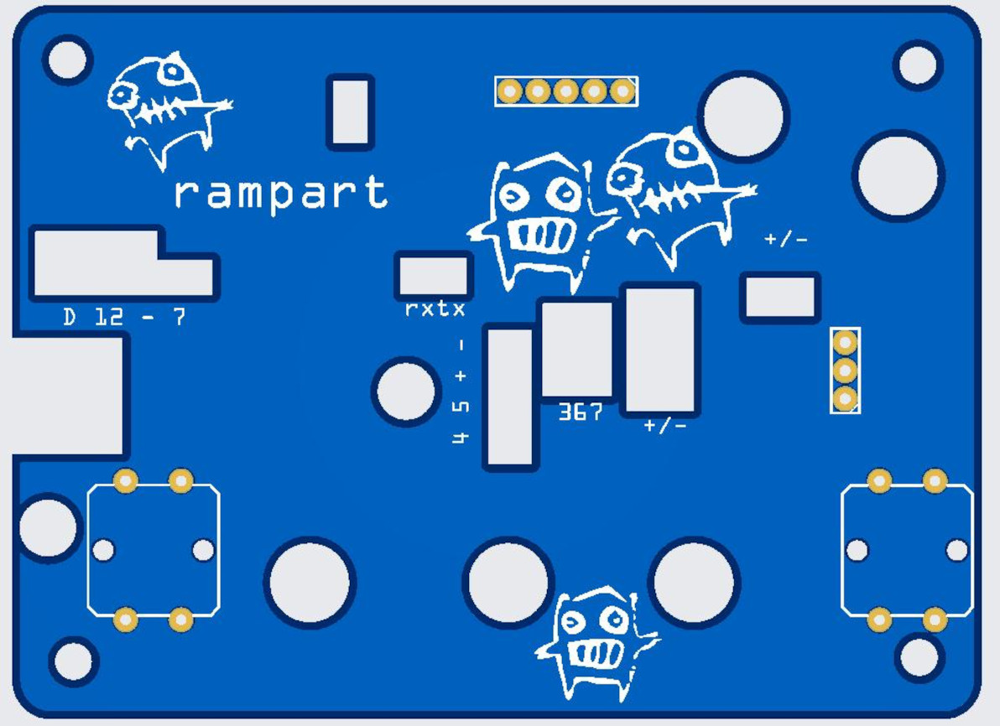
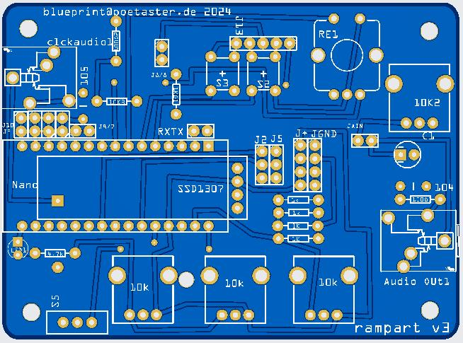
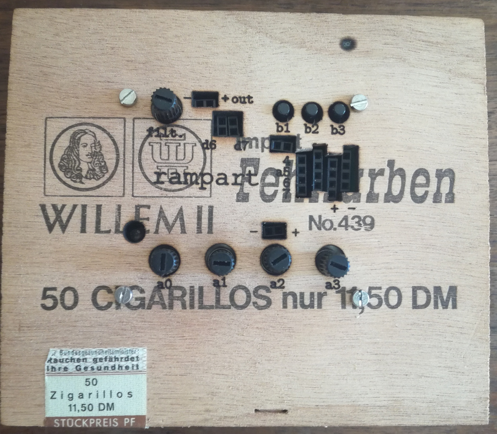

# rampart
An arduino semi-modular synth companion to keep, moat and bastl's kastle.

The prototype uses an Arduino Nano. The Mozzi library is used for synthesis.

## Hardware

* 3 pots
* 1 encoder w/button
* 2 buttons
* tactile switch w/LED
* CV inputs (analog)
* header for a SSD1306 display 
* analog filter/volume control
* audio/clock in
* audio wired stereo out
* headers for most digital and analog pins

Analog Pins 0-2 are potentionmeters. Analog pins 3-7 (4 avaible as an input) are used for modulation signal inputs. 

Pins 4&5, also SCL/SDA are layed out such that a SSD1306 could be used for a display.

Digital Pin 9 is audio (PWM) out, the Mozzi standard. 

Digital 2 - 6 are used for two buttons, an encoder and encoder button.

The layout includes an analog lowpass/volume knob and analog clock/audio in (pocket operator compatible).

The two buttons are located on the top pcb as is a 3pin header which is layed out GND/IO/VCC for connecting things like touch panels.

## Fritzing 

There are two Fritzing files used, one for the main pcb and one for the top (pictured above).

## Arduino Sketches

The currently most complete sketch is the rampart3-bytebeat sketch. 

A number of Arduino sketches being updated include 2 synths (switch with button 3 on digital pin 2) which have 3 to 4 variable parts of the signal. Both sketches share the wavepacket object as 1st synth. One has PDResonant as second, one an FM synth as second synth.

So, Patch 1 is always a wavelet (based on the wavelet example with mozzi) synth and Patch 2 is an FM synth or PDResonant. Also still rough ideas.

This synth works well with Keep (moat), my analog synth and also with Bastl's Kastle synth. I've also played it with Korg's micro modular which works quiet well (in both directions).

I've included a granular synth without mozzi as an example and two versions of a 'glitch synth' from other sources modified to work with rampart.

## Physical inputs

A note on -/+ located to the left below the volume knob ... these can also be used as input ;) If you take an internal signal (say my moat or a korg micromodular) you can use the filter to simply 'mix' the signals.

## Upgrading firmware:

First you need to make sure you have drivers installed. A good reference for the usb drivers (which work form most arduino boards or the lgt in rampart):
https://learn.sparkfun.com/tutorials/how-to-install-ch340-drivers/all

The most current firmware hex files will be included in this directory and can be flashed  as follows

### linux: the device will most probably be ttyUSB0 as below:

* install avrdude using package manager 
* attach the rampart  to usb
* execute: avrdude -c arduino -b 57600 -F -P /dev/ttyUSB0 -p atmega328p -U flash:w:rampart3-bytebeats.ino.hex

### windows:

* having installed the driver, above
* install avrdude from https://github.com/avrdudes/avrdude/releases (windows x64, x86 or arm64)
* attach the rampart  to usb
* execute command: "wmic path Win32_SerialPort Where "Caption LIKE '%%COM%%'" Get Description, DeviceID" 
* note the DeviceID of the "USB Serial Device" which will  be something like: "COM5" 
* using the DeviceID you've noted, adapt the following command (here -PCOM5).
* execute from the directory where you placed the hex file (dir command to get there): "avrdude.exe -patmega328p -carduino -D -PCOM5 -b57600 -Uflash:w:rampart3-bytebeats.ino.hex" 

### macintosh:

* install the usb driver for the rampart using instructions from : https://github.com/WCHSoftGroup/ch34xser_macos has a .pkg file you can install.
* install avrdude through MacPorts or Homebrew. (with home-brew it: $brew install avrdude).
* attach the rampart  to usb
* in a terminal execute: "ls /dev/tty*" and note names with tty.wch in them  like : tty.wchusbserial1234
* from the directory where you downloaded the hex file execute: avrdude -c arduino -b 57600 -F -P /dev/tty.wchusbserial1234 -p atmega328p -U flash:w:rampart3-bytebeats.ino.hex
 

## Sales :)

I sell the latest versions of these as kits and completeed build at https://poetaster.org, on https://tonetoys.etsy.com and on Tindie:

# Historical versions

